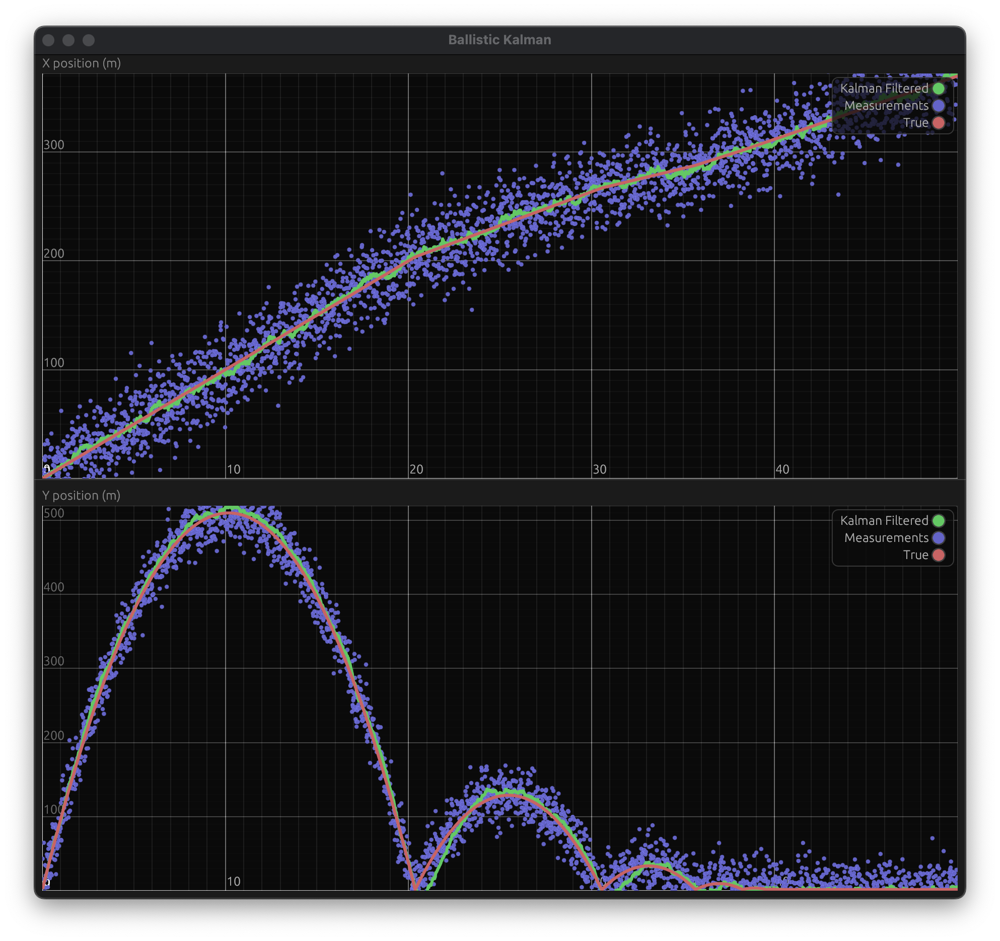

# **ballistic-kalman-filter**


Kalman filter position tracking of ballistic object in Rust.  
Small experimentation using [rapier](https://rapier.rs/) physics engine, [linearkalman](https://docs.rs/linearkalman/0.1.3/linearkalman/) as well as [egui](https://docs.rs/egui/0.20.1/egui/) for visualization.  

<p align="center">
  
</p>

## **What it does**
```./src/physics.rs```  
I used the [rapier](https://rapier.rs/) physics engine in order to simulate the ballistic trajectory of a rigidbody thrown in the air.  
Then, I added gaussian errors to true positions in order to simulate real sensors (```./src/physics.rs```).  

```./src/kalman.rs```  
I then used the crate [linearkalman](https://docs.rs/linearkalman/0.1.3/linearkalman/) to integrate Kalman prediction and update steps following a linear state model in a gravity field without control.

```./src/gui.rs```  
A real-time graphical plotting is implemented, showing the measurements points, the true trajectory as well as the filtered trajectory.

```./src/main.rs```  
Launching the simulation physics and Kalman tracking in one thread and the GUI in another. Both communicating through an mpsc channel.

## **How to run**
Clone the repository.
```bash
gh clone alelouis/ballistic-kf
```
Then run main binary using cargo, preferably in release mode.
```bash
cargo run --release
```